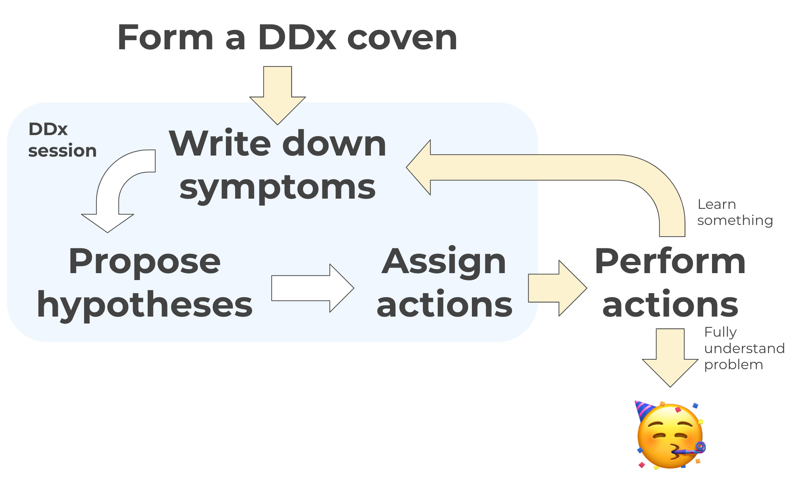

**Differential diagnosis** – "DDx" for short – is a super effective strategy for investigating and
solving problems in complex systems. Differential diagnosis keeps us from falling into the most
common pitfalls of cross-role troubleshooting: information siloing, toe-stepping, and loss of
direction.

In order to solve a complex problem using differential diagnosis, we start by forming a small team
called a *coven*. The coven meets daily for a short *DDx session*. In the DDx session, we first
write down the *symptoms* we can observe. Then, we come up with some *hypotheses* that could
possibly explain those symptoms. And finally, we agree upon a set of *actions* to take. Once those
actions have been taken, we meet back up for another DDx session. We iterate through this process
until we've understood the problem we're trying to understand.

This site puts together a bunch of resources for learning about DDx and implementing it on your
team:

* **[DDx Crash Course](/crash-course/intro)**: A crash course on differential diagnosis: fundamental
    concepts, vocabulary, and how it all fits together.
* **[Sample DDx investigation](/sample-runthrough)**: A fictional account of a DDx troubleshooting
    effort, which may give you a clearer picture of how this stuff works in real life.
* **[Getting Started Guide](/getting-started)**: Advice for the practitioner who wants to bring
    differential diagnosis to their organization.
* **[Outside resources](/outside-resources)**: Links to further reading on DDx and related concepts.
* **[Me!](/about)**: I've been doing this for a long time, and I'd love to hear about how
    you use DDx in your org or discuss any challenges you've had with it.
